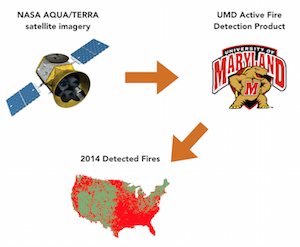
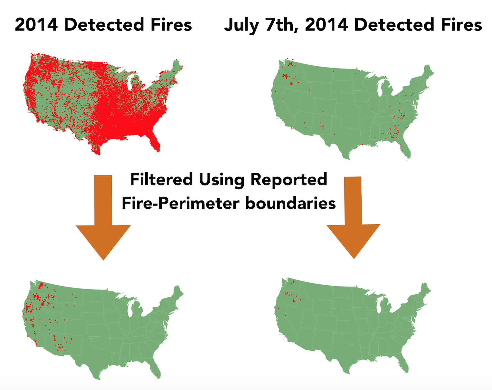
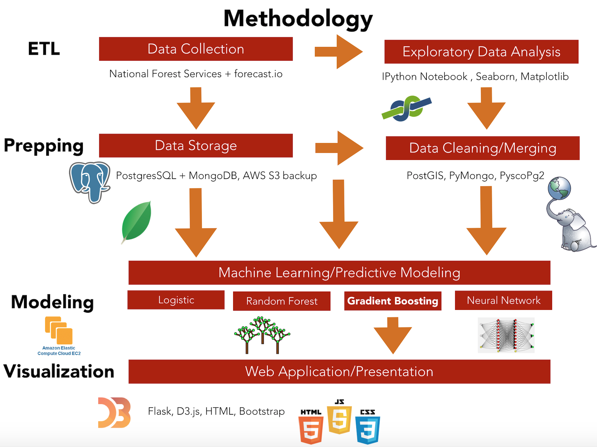

# Building a Model for the Early-Detection of Forest-Fires

To date, hundreds of forest fires have burned over 9 million acres of land in 2015, causing millions of dollars in property damage and immeasureable loss and pain to those families effected. Currently, satellite imagery of detected fires is not used in real-time to aid in forest fire protection. What if we **could** use that satellite imagery to aid in forest fire protection?

Each day, there are hundreds of satellite images from NASA's AQUA and TERRA satellites that are run through the UMD active fire product. The output of this active fire product is a data set that holds hundreds of 'detected fires' at given latitude/longitude coordinates. We can aggregate this data set to the year level, and see that a map of all detected fires for a given year is incredibly crowded. It's important to note, though, that these fires could be house fires, farmer burn piles, or even forest fires. Currently, this detected fires data set is not used in real-time for forest fire prevention. A large part of this could be that there is no easy way to tease out which of these detected fires are forest fires. What if there was a way that we could parse down this data set into only those detected fires which are forest fires? There is!

Each day, states are required to submit forest-fire perimeter boundaries. If we compare the latitude/longitude coordinates of the dectected fires with the forest-fire perimeter boundaries, we can pare down the detected fires data set to only those fires which are forest fires. The problem with this, though, is that we are doing it historically / after-the-fact. What if we wanted to do this in real time? This is where data science comes in... 

Using data science and machine learning, we can build a model that takes in the detected fires data set and tells us which of those detected fires are actually forest fires.  My current methodology has focused upon using the detected fires data set, along with geographical features, to fit the best predictive model as measured by ROC area under the curve. 

## Current Status / Next steps

This project has been "terminated," so to speak. I had a conversation with somebody at Forest Services, who pointed me towards what should be a much more useful data set. Hopefully that data set will allow me to move closer to the goal I set out with at the start of this project. 

Before diving in with this other data set, I'm going to spend a little bit more time cleaning (see branch 'refactorville') this repo and getting it to a good stopping point. That's where I'm currently at. 

