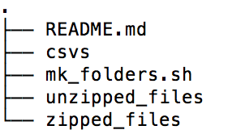
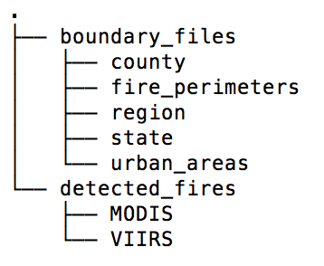
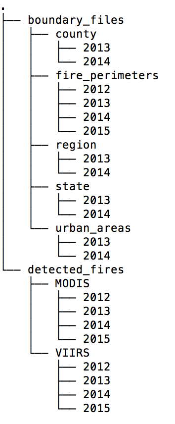

## The Data

The data used for this project is all publicly available. At this point, I am only pulling data from the following three sources: 

1.) [Fire detection data](http://firemapper.sc.egov.usda.gov/gisdata.php)  
2.) [State, County, Region, and Urban Area shapfiles](https://www.census.gov/geo/maps-data/data/tiger-cart-boundary.html)  
3.) [Fire perimeter Boundaries](http://rmgsc.cr.usgs.gov/outgoing/GeoMAC/historic_fire_data/)  

### Data Structure

1.) Each row of the fire detection data is a 'detected fire', as determined by running satellite imagery from NASA’s AUQA and TERRA satellites through [the University of Maryland's active fire detection product](http://modis-fire.umd.edu/pages/ActiveFire.php). For each row, the geometry we have for it is the latitude/longitude. We then also have a number of other observables and outputs from UMD's active fire detection product. 

2.) The state, county, region, and urban area shapefiles contain the boundaries for each of those respective geographic types. As of right now, the census has these files for 1990, 2000, 2010, 2013, and 2014. I'm currently looking at only 2012-2015 data, and will be using the 2014 geographic boundary shapefiles for 2015, and 2013 geographic boundary shapefiles for 2012. 
      
3.) A sizeable number of states report forest fire perimeter boundaries each day, which is what the fire perimeter boundary files contain. They also contain other information relating to those fires, such as the fire name, date, number of acres burned thus far, etc. At this point, I am simply using these fire perimeter boundaries to determine if the latitude/longitude coordinates of a detected fire (from data source (1)) fall within a fire perimeter. If they do, then I know this detected fire is a forest fire. If they don't, I can't be certain it's not a forest-fire. This is because there are varying levels of both participation and accuracy in the submitting of forest-fire perimeter boundaries (this is discussed/shown in more detail in the `code/eda-viz/in_proj` folder, accessible from the main folder of this repository).  

### Data Folder Structure 

There is currently no data showing in this folder. However, there are scripts meant to facilitate download - `mk_folders.sh` (located in this folder), the `Makefile` located in the main folder of this repository, and `manage_psql_dts.sh` (located in the `code/data_setup/` folder, accessible from the main folder of this repository). Together, these will create the folder structure given by the pictures below, and populate each of the folders with the appropriate data (discussed below the picture). These files can be called in conjunction by running `make data` from the main folder of this repository (while it could be done without `make`, the data downloads actually happen within the `Makefile` located in the main folder, and the files need to be called multiple times with different arguments; it's your journey, though). 

This is what the folder structure from this `data` directory should look like (e.g. the first level) once it's all set up: 

 

The three main folders that will store the downloaded data are used as follows: 

1. `zipped_files` - All of the raw data (`1`, `2`, and `3` above) are all downloaded as `zipped` files originally, and placed within this folder. They are further differentiated by whether they are boundary files (and what kind) or detected fires (and from what source). The `zipped_files` folder structure should look like this once it's all set up: 

 

2. `unzipped_files` - All of the raw data, but unzipped. The `unzipped_files` folder structure should look like the following once it's all set up: 

 

3. `csvs` - This stores all of the data after everything has been merged together. There is no picture for the folder structure here because this folder doesn't have any subfolders - its full of `csvs` and that's it. 

**Notes**: 

* I haven't shown any of the actual data files in the tree structures above, but did show all of the folders that can be expected once everything is set up. This was to save space.  
* `mk_folders.sh` simply creates the folder structure, whereas the `Makefile` in the main folder actually downloads the zipped data and unzips it. `manage_psql_dts.sh` (in `code/data_setup/`, accessible from the main folder of the repository) actually reads it all into Postgres to perform some merging and output the data as`csvs`. This is discussed in detail in the `README.md` in the `code/data_setup` folder. 
* This folder is meant to store all the raw data after it is downloaded and merged together, but before any of the feature engineering has taken place. After feature engineering is done (at least how I've set it up with the `make features` command run from the main directory), the data will be stored in `code/modeling/model_input/`. 

